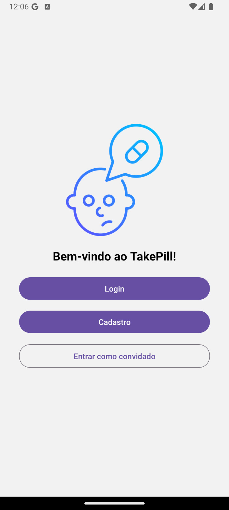
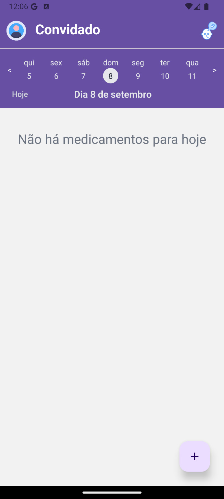

# Take Pill: Aplicação para controle e lembretes de medicamentos

  
  

## Descrição do Projeto

Projeto desenvolvido para a disciplina de Sistemas Operacionais do curso de Análise e Desenvolvimento de Sistemas do Instituto Federal de Educação, Ciência e Tecnologia da Paraíba Campus Cajazeiras. Trata-se de uma aplicação mobile que permite aos usuários registrar e excluir medicamentos, marcá-los como tomados ou ignorados e receber lembretes automáticos nos horários programados.

## Status do Projeto

:arrows_counterclockwise: Em progresso

## :man_mechanic: Linguagens e Ferramentas Utilizadas

- `React Native`
- `SQlite`
- `HTML`
- `CSS`
- `Javascript`
- `Vscode`
- `Docker`
- `Git`
- `Vim`

## :hammer: Funcionalidades do projeto

- `Funcionalidade 1`: Autenticação.
- `Funcionalidade 2`: Adicionar medicamento.
- `Funcionalidade 3`: Excluir medicamento.
- `Funcionalidade 4`: Marcar medicamento como Ignorado.
- `Funcionalidade 5`: Marcar medicamento como tomado.
- `Funcionalidade 6`: Visualizar medicamento(s) a ser tomado(s) no(s) próximo(s) dia(s).

## :rocket: Instruções para Rodar o Projeto

1. `git clone git@github.com:ericksjp/MedicalSafeProject.git`
2. `cd MedicalSafeProject`
3. `npx expo start -c`

Para buildar o projeto com o Docker:

1. `git checkout docker`
2. `cd docker`
3. `docker compose up --build`

## :technologist: Autores

| [ ericksjp](https://github.com/ericksjp) | [ Tasso Moreira de Oliveira](https://github.com/tassomoreira) | [ Gerlândio da Silva Bernardo](https://github.com/GerlandioBernardo) |
| :------------------------------------------------------------------------------------------------------------------------------------: | :--------------------------------------------------------------------------------------------------------------------------------------------------------: | :----------------------------------------------------------------------------------------------------------------------------------------------------------------: |
