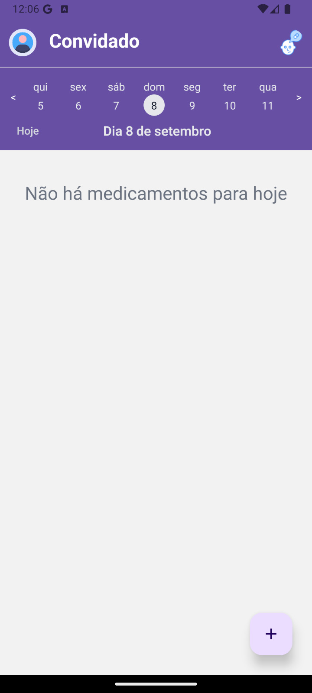

<h1 align="center">Aplicação para controle e lembretes de medicamentos</h1>

  
  

  <h2>Descrição do Projeto</h2>
  

    Projeto desenvolvido para disciplina de Sistemas Operacionais do curso de Análise e Desenvolvimento de Sistemas do Instituto Federal de Educação, Ciência e Tecnologia da Paraíba Campus Cajazeiras. Trata-se de uma aplicação moblie que permite aos usuários registrar e excluir medicamentos, marcá-los como tomados ou ignorados e receber lembretes automáticos nos horários programados
  

  <h2>Status do Projeto</h2>
  
:heavy_check_mark: Concluído 

  <h2>:man_mechanic: Linguagens e Ferramentas Utilizadas</h2>

- ``React Native``
- ``SQlite``
- ``HTML``
- ``CSS``
- ``Javascript``
- ``Vscode``
- ``Docker``
- ``Git``
- ``Vim``
<h2>:hammer: Funcionalidades do projeto</h2>
  
  - `Funcionalidade 1`: Autenticação.
  - `Funcionalidade 2`: Adicionar medicamento.
  - `Funcionalidade 3`: Excluir medicamento.
  - `Funcionalidade 4`: Marcar medicamento como Ignorado.
  - `Funcionalidade 5`: Marcar medicamento como tomado.
  - `Funcionalidade 6`: Visualizar medicamento(s) a ser tomado(s) no(s) proximo(s) dia(s).

 <h2>:rocket: Instruções para Rodar o Projeto</h2>
 1️⃣  git clone git@github.com:ericksjp/MedicalSafeProject.git
   
 2️⃣  cd MedicalSafeProject
   
 3️⃣  npx expo start -c
   
 
Para buildar o projeto com o docker:

 1️⃣  git checkout docker
   
 2️⃣  cd docker
   
 3️⃣  git compose up --build
 
 
 
<h2> :technologist:  Autores</h2>
  <table >
  <tbody>
    <tr>
      <td align="center" valign="top" width="35%">
        <a href="https://github.com/ericksjp">
          
           
          
            <b>Erick Ribeiro de Sousa</b>
          
        </a>
      </td>
      <td align="center" valign="top" width="35%" >
        <a href="https://github.com/tassomoreira">
          
           
          
            <b>Tasso Moreira de Oliveira</b>
          
        </a>
      </td>
        <td align="center" valign="top" width="35%">
        <a href="https://github.com/GerlandioBernardo">
          
           
          
            <b>Gerlândio da Silva Bernardo</b>
          
        </a>
      </td>
    </tr>
  </tbody>
</table>
 
